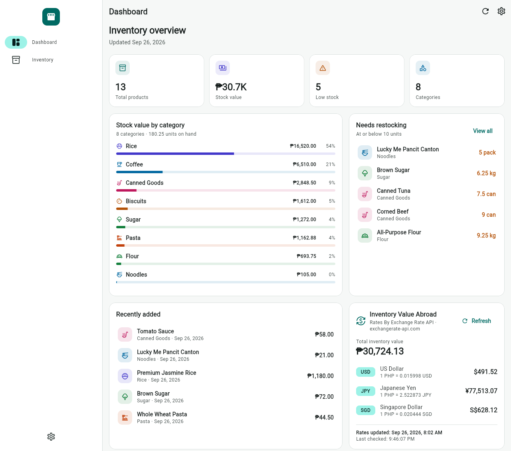
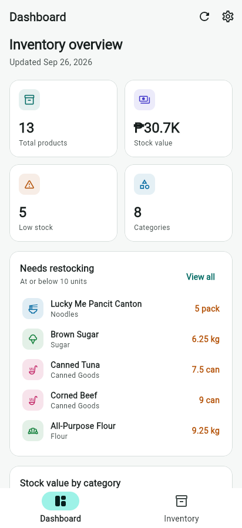
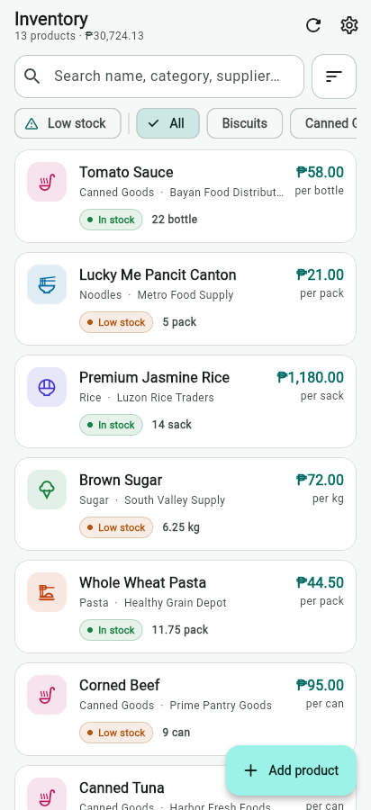
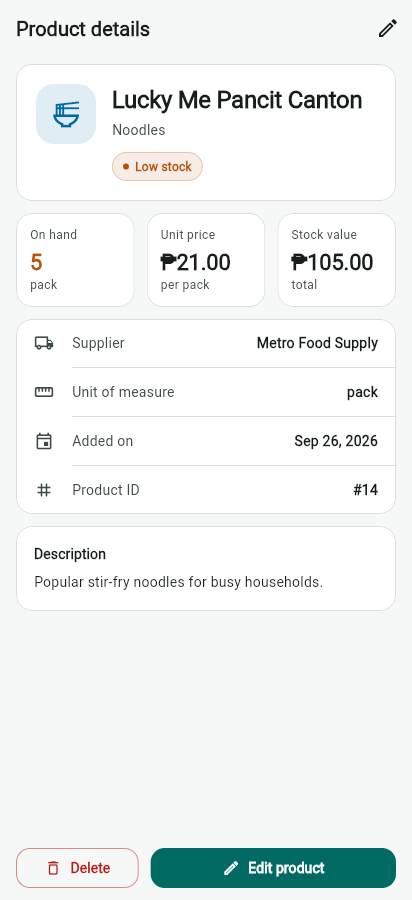
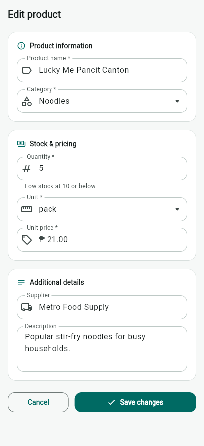

# Dry Goods Inventory Management System

A Flutter app for managing a dry goods store's stock (rice, sugar, flour, canned goods, and more), backed by a custom
PHP REST API and a MySQL database. It supports full CRUD for products, highlights low stock, and uses a free
third-party API to show the inventory's value in other currencies.

**Third-Party API: ExchangeRate-API, https://open.er-api.com/v6/latest/PHP** (no key required)



## Features

- **Dashboard:** total products, stock value, low-stock count, stock value by category, items that need
  restocking, and recently added products.
- **Inventory:** search by name, category or supplier; filter by category or low stock; sort by name, stock,
  price or value.
- **CRUD:** add, view, edit and delete products through the custom PHP API, with input validation in the app and on
  the server.
- **Inventory Value Abroad:** converts the total inventory value from ₱ into USD, JPY and SGD using live exchange
  rates, with loading, error/retry and "rate unavailable" states.
- **Portable:** runs on Android, iOS, web, Windows, macOS and Linux. The server URL can be changed in the app
  (**Server settings**, with a *Test connection* button) without rebuilding.
- **Responsive design:** bottom navigation on phones, side navigation on tablets and desktops; light and dark mode.

## Tech stack

| Layer | Technology |
|---|---|
| Mobile / web app | Flutter (Dart 3.8), Material 3, `http`, `shared_preferences` |
| Backend API | PHP 8 with PDO (prepared statements), JSON responses |
| Database | MySQL / MariaDB |
| Local development | XAMPP (Apache + MySQL), VS Code |
| Hosting | Freehostia (PHP + MySQL), DuckDNS domain |
| Third-party API | [ExchangeRate-API](https://www.exchangerate-api.com) open access endpoint |

## Third-party API

| | |
|---|---|
| Provider | ExchangeRate-API: [Rates By Exchange Rate API](https://www.exchangerate-api.com) |
| Endpoint | `GET https://open.er-api.com/v6/latest/PHP` |
| API key | Not required (open access) |
| Used in | `lib/services/external_api_service.dart` (request), `lib/models/exchange_rates.dart` (JSON parsing), `lib/widgets/inventory_value_abroad_card.dart` (UI) |

The app checks the HTTP status code and the API's `"result": "success"` field, and shows a friendly message with a
**Retry** button if there is no internet, the request times out (10 s), or the response is unexpected. The rest of
the app keeps working if this API is down.

## Custom API endpoints

Base URL: `http://<server>/MobApp-midEXAM/backend/api/dry_goods.php`

| Method | URL | Body | Description | Success |
|---|---|---|---|---|
| `GET` | `/dry_goods.php` | — | List all products (newest first) | `200` |
| `GET` | `/dry_goods.php?id=1` | — | Get one product | `200` / `404` |
| `POST` | `/dry_goods.php` | JSON product | Create a product | `201` / `422` |
| `PUT` | `/dry_goods.php?id=1` | JSON product | Update a product | `200` / `404` / `422` |
| `DELETE` | `/dry_goods.php?id=1` | — | Delete a product | `200` / `404` |

Example product body:

```json
{
  "product_name": "White Sugar",
  "category": "Sugar",
  "quantity": 12,
  "unit": "kg",
  "price": 68.5,
  "supplier": "City Grain Traders",
  "description": "Fine white sugar for household and baking needs."
}
```

Every response has the form `{ "success": true|false, "message": "...", "data": ..., "errors": {...} }`. Hosts that
block `PUT`/`DELETE` can send `POST` with the header `X-HTTP-Method-Override: PUT` or `DELETE`.

## Setup

### 1. Database

1. Start **Apache** and **MySQL** in XAMPP.
2. Open `http://localhost/phpmyadmin` and import `database/dry_goods.sql`. This creates the `dry_goods_db` database
   with sample data.

### 2. Backend configuration

The real database password is kept in a file that is **not** committed to GitHub.

```bash
copy backend\config\db.local.example.php backend\config\db.local.php
```

Open `backend/config/db.local.php` and fill in your own values (for XAMPP the default is user `root` with an empty
password). `backend/config/db.php` loads this file automatically. `db.local.php` is listed in `.gitignore`.

Place (or copy) the project folder in `C:\xampp\htdocs\MobApp-midEXAM`, then check that
`http://localhost/MobApp-midEXAM/backend/api/dry_goods.php` returns JSON.

### 3. Flutter app

```bash
flutter pub get
flutter run -d chrome        # or: -d windows, or an Android emulator/phone
```

The app picks a default API URL for the platform it runs on:

| Where the app runs | Default API base URL |
|---|---|
| Web / Windows / macOS / Linux | `http://localhost/MobApp-midEXAM/backend/api` |
| Android emulator | `http://10.0.2.2/MobApp-midEXAM/backend/api` |
| Real phone or hosted server | Set it in **Server settings** (gear icon) |

To build with a fixed server URL:

```bash
flutter build apk --release --dart-define=API_BASE_URL=https://your-domain/MobApp-midEXAM/backend/api
```

### 4. Tests

```bash
flutter analyze
flutter test
```

## Deployment

- [docs/API_DEPLOYMENT_GUIDE.md](docs/API_DEPLOYMENT_GUIDE.md): XAMPP and server deployment, testing every endpoint.
- [docs/DUCKDNS_DEPLOYMENT.md](docs/DUCKDNS_DEPLOYMENT.md): making the server reachable through a DuckDNS domain.

## Screenshots

| Dashboard (phone) | Inventory | Product details | Edit product |
|---|---|---|---|
|  |  |  |  |

## Project structure

```text
lib/
  config/app_config.dart            App settings and API URLs
  models/                           DryGood and ExchangeRates (fromJson)
  services/                         PHP API client, ExchangeRate-API client, shared inventory state
  screens/                          Dashboard, inventory, details, add/edit form, server settings
  widgets/                          Product card, exchange-rate card, shared UI
backend/
  api/dry_goods.php                 REST API (GET, POST, PUT, DELETE)
  config/db.php                     Loads database settings
  config/db.local.example.php       Template: copy to db.local.php
database/dry_goods.sql              Schema and sample data
```
